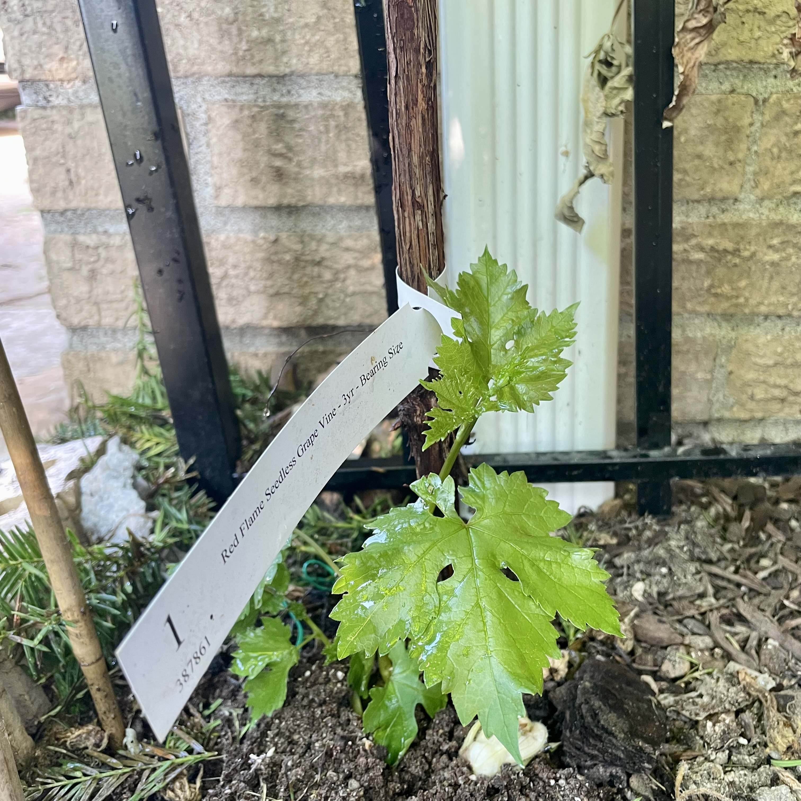

---  
share: true  
date: 2022-05-11 12:30  
modified: 2022-08-28 12:00  
---  
  
# Growing grapes  
  
## Grape varieties  
  
- **Red flame**  
  - Seedless  
  - Best in zones 7-10, possibly zone 6  
  - Want full sun for 6-8 hours/day  
  
- **Himrod** (Green)  
  - Seedless  
  - Best in zones 5-8  
  - Want full sun for 6-8 hours/day  
  
## Experience  
  
I purchased both Red Flame and Himrod four year old hardwood rootstocks from [tytyga.com](https://tytyga.com). The stocks arrived on April 20th, 2022 and were approximately 12" long, 1/2" in diameter and had many ~4" roots. I planted them in plastic pots so that they can start getting established while the ground continues to warm up.  
  
**May 11th:** I planted both grape stocks in the ground in an area that gets full sun. It is not clear whether either stock has any additional root growth than the day I received them.  
  
**May 19th:** No major growth from either plant. The Red Flame has some green wood under the bark and small amounts of root growth. The Himrod has neither. I transplanted the Himrod to a small container to make room for other plants and left the Red Flame in the ground.  
  
**August 28th:** Today after checking on the Red Flame for the first time in a few months I noticed that it finally has some growth — a new shoot at the base of the rootstock. I ended up throwing out the Himrod a month or two ago after not seeing any progress.  
  
  
  
