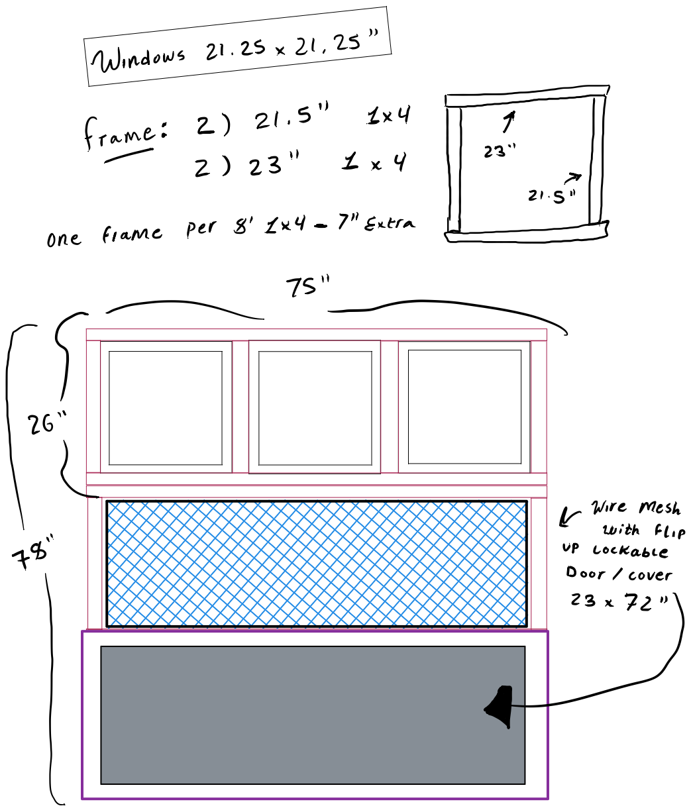
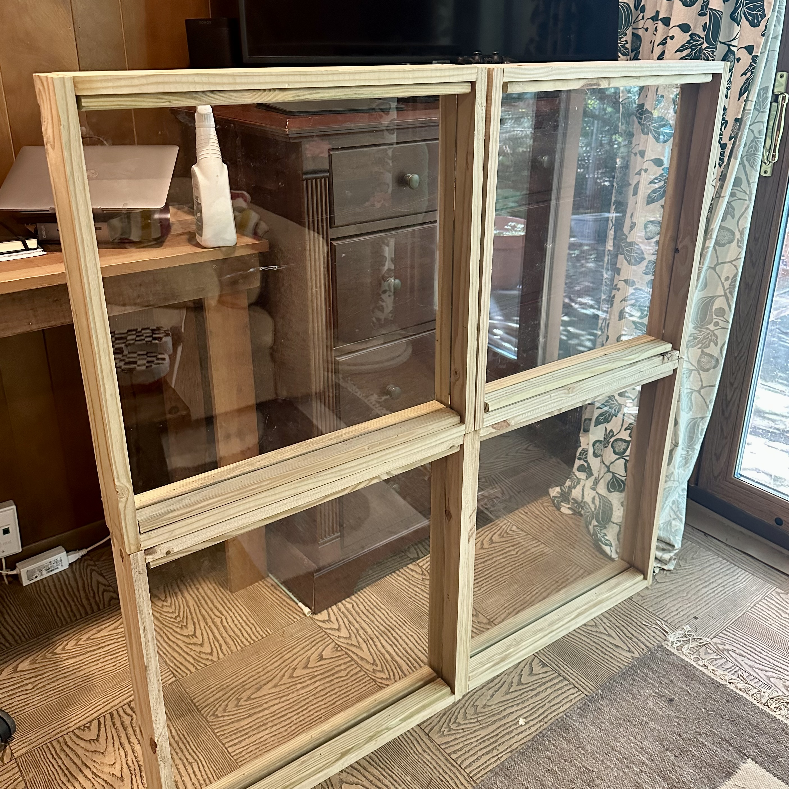
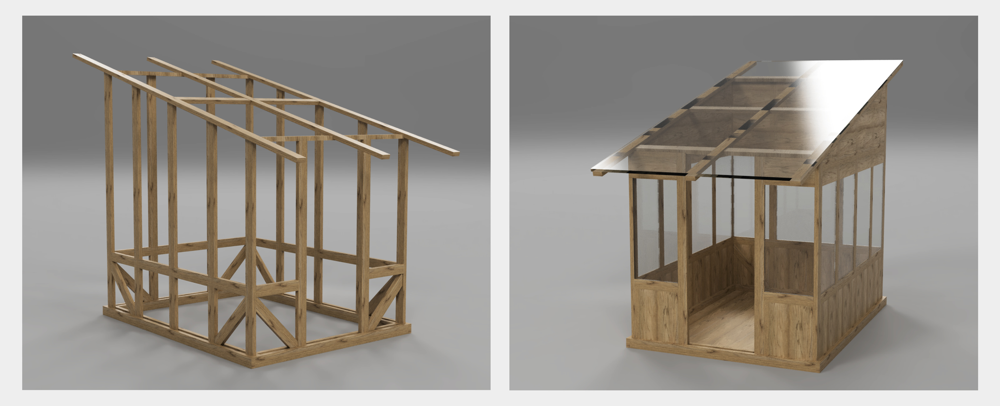

---  
share: true  
date: 2022-08-14 20:30  
updated: 2022-09-29 13:00  
---  
  
# Greenhouse  
  
## Description & considerations  
==TODO==  
  
## Drawings  
  
  
## Cut list  
### Window frames  
- One window frame requires one 1x4x8 and one 1x2x8  
	- 1x4  
		- 2) 21.5” 1x4  
		- 2) 23” 1x4  
	- 1x2  
		- 4) 21” 1x2  
  
  
  
### Building frame  
- ==TODO:== 2x6s... etc  
  
## Previous ideas  
I typically like to plan out large projects in Fusion 360. This always helps me catch problems that I otherwise wouldn't realize until after beginning construction. Here is a model I made when first thinking through this project.  
  
  
  
A lot has changed since making this model — most importantly, the side of the windows — and, unfortunately, I haven’t yet fully embraced the power of _actual_ parametric modeling so I have not yet updated this model to reflect the current design.